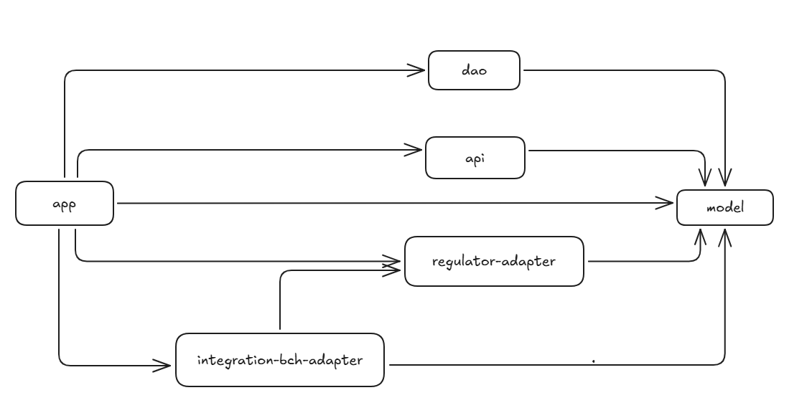
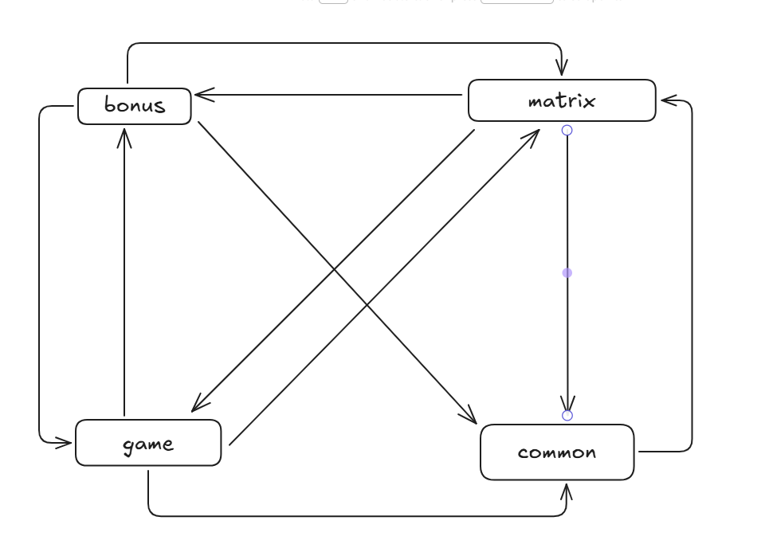

- Поддерживается ли МУРА для каких-либо ваших проектов?

#### Проекты 
Первым делом проверила рабочие проекты. 
Каждый проект представляет собой совокупность модулей maven, и я рассматривала каждый модуль maven в качестве узла графа. Оказалось, что да - все наши проекты сделаны в соответствии с принципом МУРА.  
Для примера разберу один из них.

В проекте есть 6 модулей maven (в качестве языка используется Java, фреймворк - Spring). 

- model - здесь находятся основные DTO (data transfer objects); Enums, которые предсталяют собой основные типы данных; интерфейсы, которые реализуют DTO и Entities.
- dao - здесь находятся Entities (сущности ORM Hibernate, которые маппятся на таблицы базы данных); репозитории, которые предоставляют CRUD операции для работы с Entities.
- api - здесь находятся классы, которые реализуют API сервиса. Класс с перечислением кодов ошибок, класс-интерфейс, где прописаны эндпойнты сервиса, класс - базовый ответ сервиса на HTTP-запрос, и т.д.  
- regulator-adapter - этот модуль инкапсулирует классы, предназначенные для интеграции со сторонним сервисом regulator. Тут интерфейс с методами, которые вызывает наш сервис; класс, который технически осуществляет вызов API; классы запросов и ответов и т.д. 
- integration-bch-adapter - этот модуль предназначен для интеграции с еще одним сервисом через Kafka. Тут классы kafka-listener, kafka-consumer, классы запросов и ответов и т.д. 
- app - здесь содержится основная бизнес-логика приложения: классы-сервисы, которые работают с Entities и DTO и вызывают классы-репозитории; классы-schedulers, которые запускают какие-то методы по расписанию; классы-контроллеры, которые обрабатывают вызовы API сервиса.

Диаграмма модулей: 

(Стрелка от потребителя зависимости к поставщику)
Здесь нет циклических зависимостей. 
- На самом нижнем уровне модуль model. 
- На втором уровне - модули api, dao, regulator-adapter.
- На третьем уровне - модуль integration-bch-adapter. 
- На четвертом, самом высшем, модуль app.

Здесь у меня возник вопрос, насколько правильно было делать зависимость модуля integration-bch-adapter от модуля regulator-adapter. Т.к. эти модули - адаптеры для взаимодействия с совершенно разными системами, то выглядит так, что они должны быть независимы дург от друга. И скорее всего возможно переделать логику, чтобы к этому прийти. 

#### Игра "3 в ряд" (ООП)
Решила проверить свой проект 3-в-ряд, который делала для курса по ООАП. 
Там у меня нет модулей maven, но все классы распределены по 4-м пакетам.

- bonus - здесь находятся классы для работы с бонусами. АТД BonusAccount, класс реализации Bonus и т.д
- common - здесь разместила классы проектирования, которые реализуют ООП-паттерны: Команда, Наблюдатель.
- game - здесь находится АТД AbstractGame, представляющий саму игру. Его базовая реализация Game, а также другие потомки, которые реализуют паттерн Декоратор. Например, класс GameWithBonuses добавляет логику работы с бонусами.
- matrix - в этом пакете находятся: АТД Matrix - игровая доска, класс Cell и другие классы, в которых реализована сама логика игры три-в-ряд (поиск комбинаций, обновление доски и т.д)

Я построила график зависимостей классов этих 4-х пакетов друг от друга, и получилась такая диаграмма:

Тут множество циклических зависимостей, и никак нельзя сказать, что проект соответствует принципу МУРА. 
Когда я писала проект, под конец у меня было ощущение сильной запутанности. Глядя на этой график, понимаю, почему. Здесь все зависит друг от друга.  
